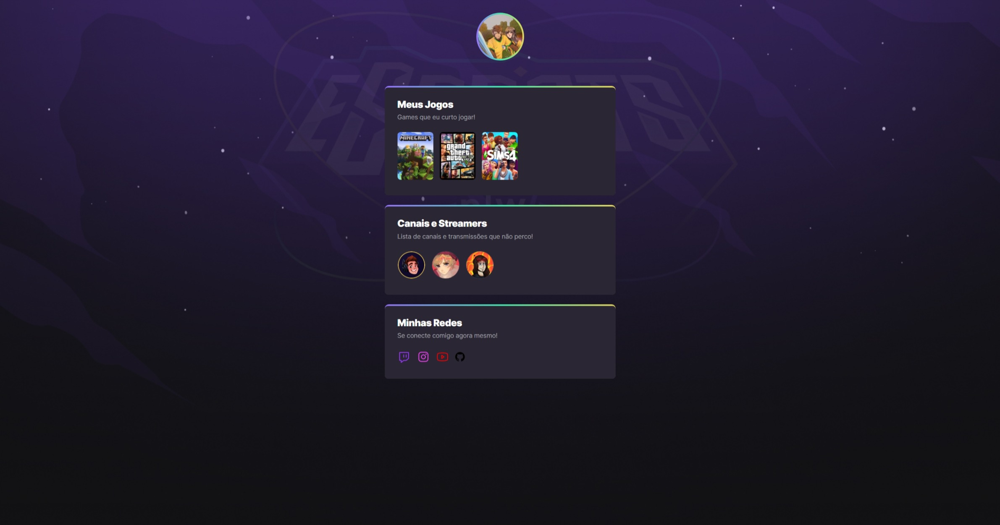

# NLW eSports 

> Trilha Explorer

Projeto construído do evento Next Level Week da Rocketseat.

[Clique aqui para acessar] (https://denothing.github.io/NLW-eSports/)

## Tecnologias 

 - HTML
 - CSS
 - Git e GitHub

## O que aprendi?

 Comecei o projeto com zero conhecimento sobre a área, e eu não fazia a mínima idéia do que se tratava. O que era HTML? Do que se trata CSS? Foram coisas que me perguntava enquanto assistia as aulas. Durante esse processo de aprendizagem, eu pude ter uma noção muito maior de como funciona o universo da programação e também sobre algumas das diversas áreas que envolvem esse mundo. Seguindo passo a passo das aulas, aos poucos pude ver o meu progresso e como cada pequeno código e cada palavra, por menor ou mais abreviada que seja, importa. Para alguém que não sabia de nada sobre o assunto, agora posso ver uma pequena luz em cima da montanha me mostrando o caminho para onde devo seguir nessa jornada da programação!

## Contato
 
 vitoreduardoasd@gmail.com

